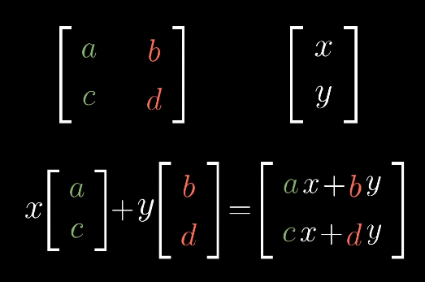
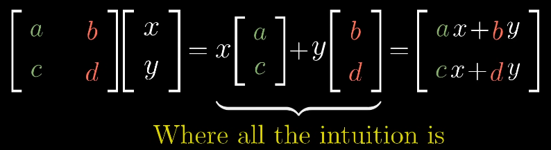
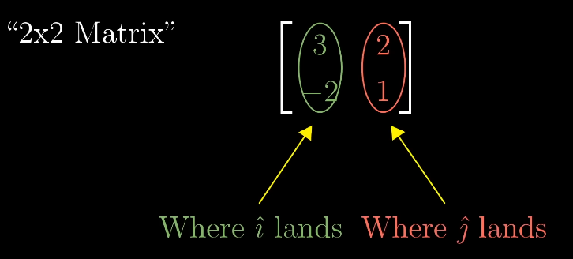
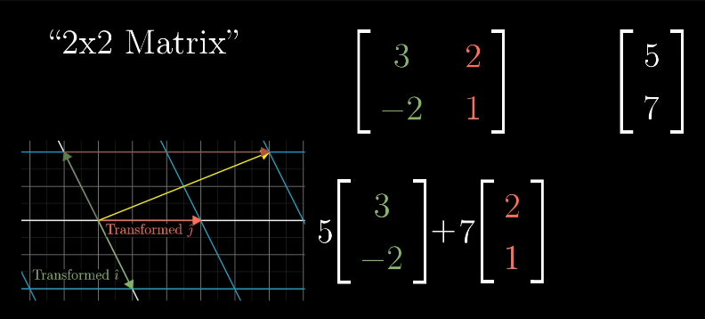
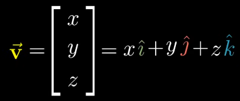
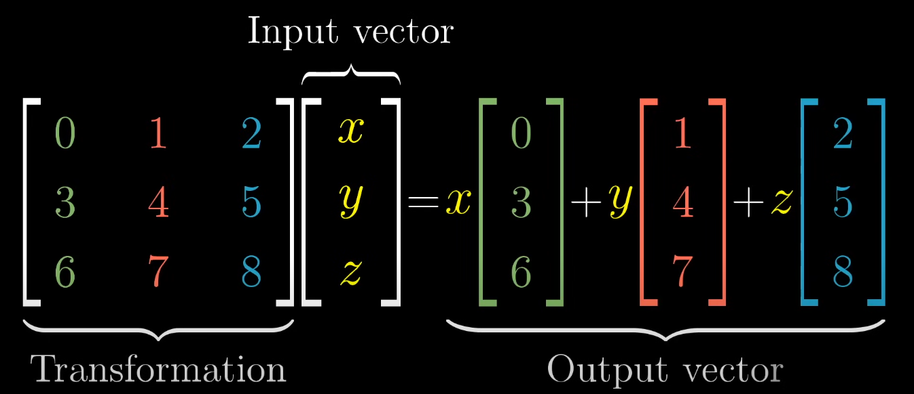
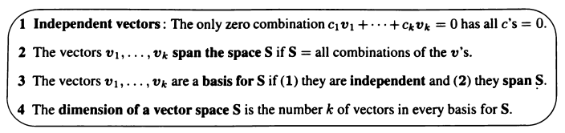
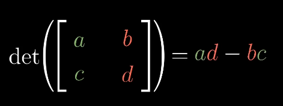
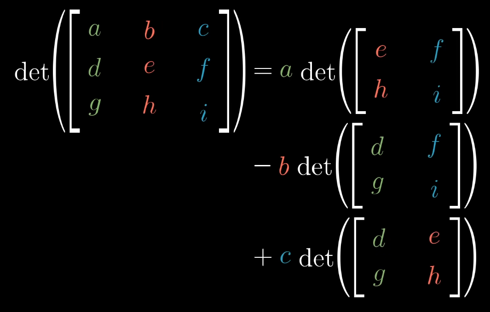

## Day 01 - Complex Numbers and Linear Algebra Basics

### Cheatsheet / Topics Covered

- Vector
  
  - Vector addition
  
  - Scalar Multiplication

- Linear Combination
  
  - eg: i and j --> (3)i + (-4)j

- Basis (i,j)

- Span (Set of vectors you can reach from the linear combination of two vectors)

- Matrices
  
  - Matrix addition
  
  - Matrix multiplication
    
  
  **Linear Transformation:**

A transformation **L** is linear if it satisfies the following two properties:

1. L(a + b) = La + Lb

2. L(ca) = cL(a)
   
   N.B. **a,b** are vectors and **c** is a scalar.

3-dimension linear transformation

Basis and Dimension

Determinant and linear dependence / independence

- If the deteminant of a matrix is 0, that means the rows or columns are linearly dependent.
  
  Also, suppose there are two vectors v1 and v2;
  
      v1 and v2 are said to be linearly dependent for a scalar c, iff v1 = c. v2

Also, **det(M1M2) = det(M1)*det(M2)**
