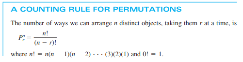
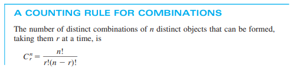

## Day 02 - Probability theory and Statistics

### Cheatsheet / Topics Covered

Probability Theory:

- Events - An event is a collection of simple events.
- Simple Events - A simple event is the outcome that is observed on a single repetition of the experiment
- Sample Space - The set of all simple events is called the sample space, S.
- 

---
**Permutations:**

  

**Combinations:**

  

**Bayes' Theorem**

  

  

Proportions → Probability → Uncertainty
