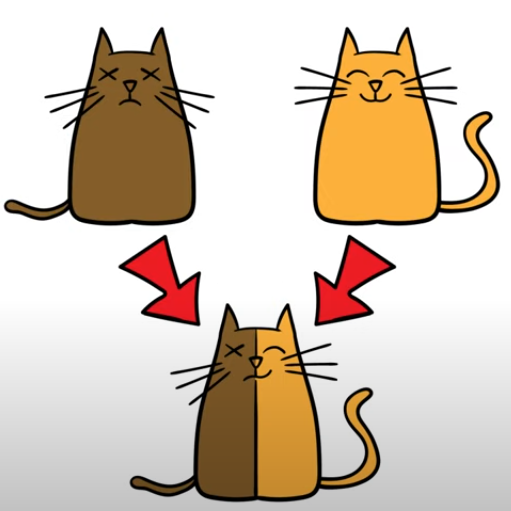
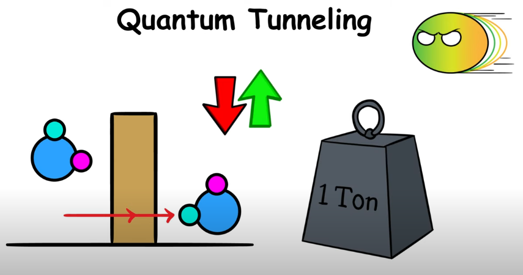

## Day 02 - Quantum vs Classical Mechanics

### Cheatsheet / Topics Covered

- Schrodinger and his cat

Quantum Mechanics 

- Superposition (Half head, half alive cat) -> Basically an object exists in many different forms in the same time

    -> Exists in multiple different     states until it is observed / measured
- Entanglement

  

- Wave Particle duality -> Particle behaves like a particle when observed but when unobserved it can display properties similar to a wave exhibiting interference pattern 

- Quantum Tunneling (less likely to happen to objects with higher masses)

  

- Young's Double Slit Experiment

