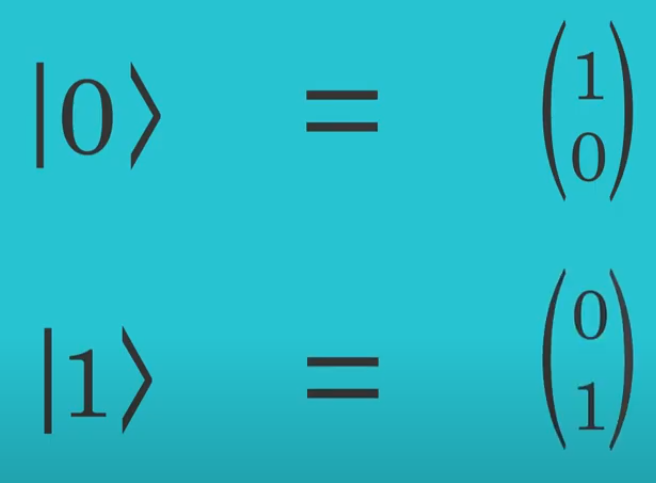
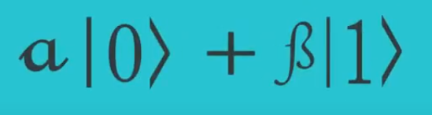

## Day 04 - Classical Computing and Boolean Algebra

### Cheatsheet / Topics Covered

- Dirac's notation (Bra-Ket Notation)

- Two states ( |0> and |1> ) 

  

- A linear combination of these states is called a superposition

  

- Quantum circuits -> Reversible [unitary matrices]

- Pauli X, Y, Z, I transformations
- Hadamard Transformation
- Cnot Gate

- X gate : |0> <-> |1>

Reference on logic gates (classical) - https://www.youtube.com/watch?v=INEtYZqtjTo