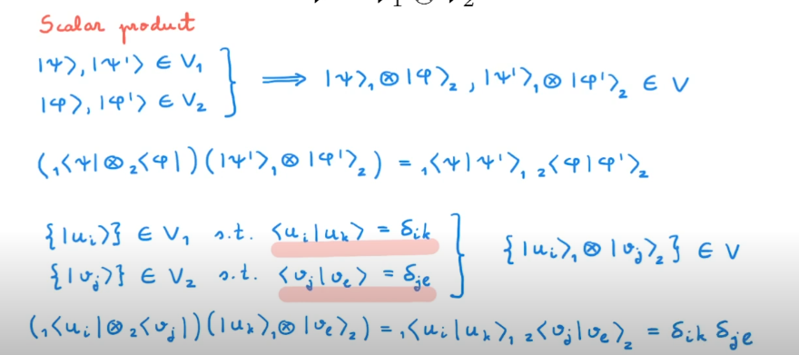
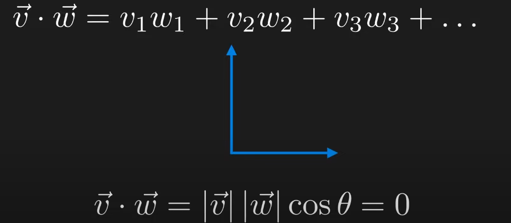
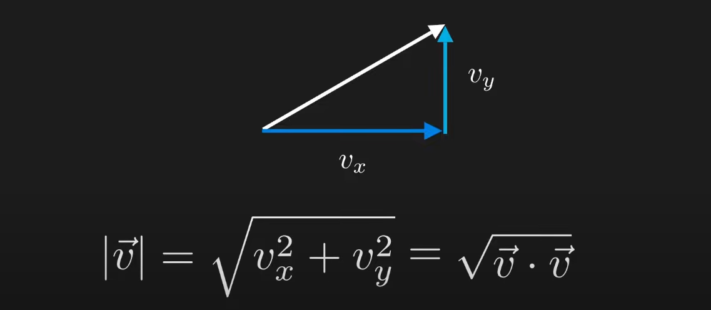
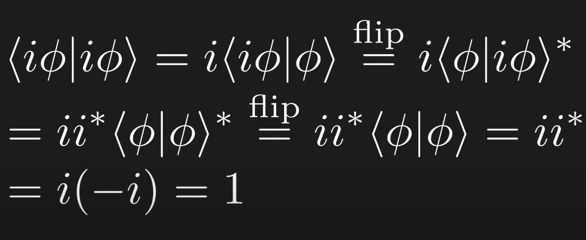
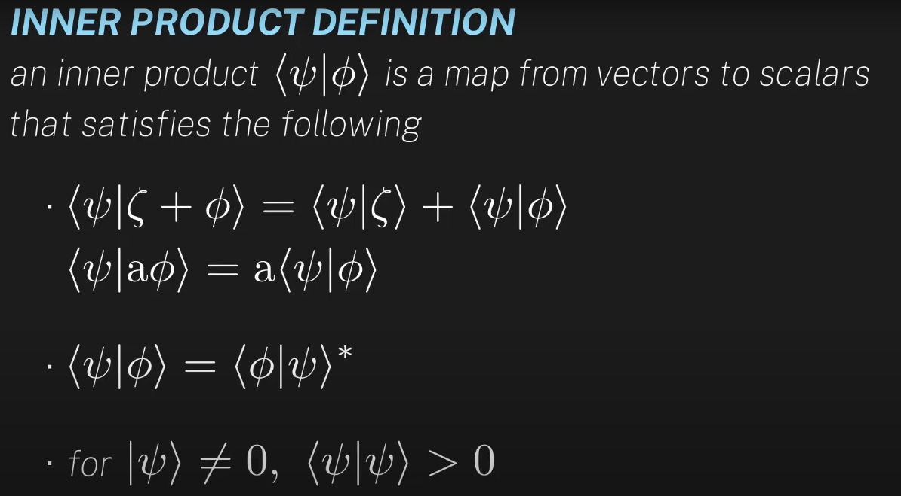
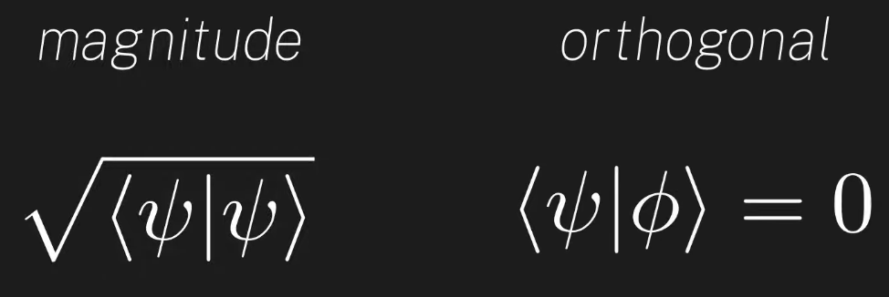

## Day 05 - Linear Algebra for Quantum Computing

### Cheatsheet / Topics Covered

- Tensor Product

  

- Entangled States

  

- Scalar Product
 

  

- Dot Product -> Measures the angle between the vectors
 

  

- Dot Product -> Calculate/ Measure the length of a vector

 

  

- Inner Product
 

  

- Defining inner product
 

  

- Two vectors are orthogonal if their inner product is 0
 

  

