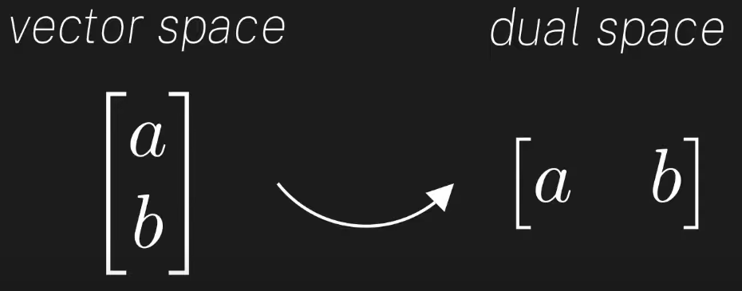
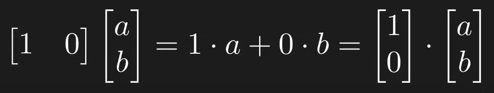
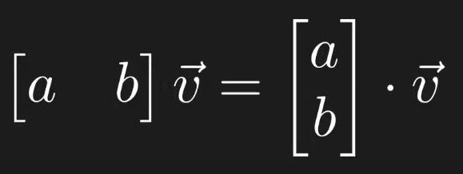
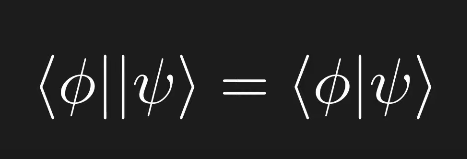
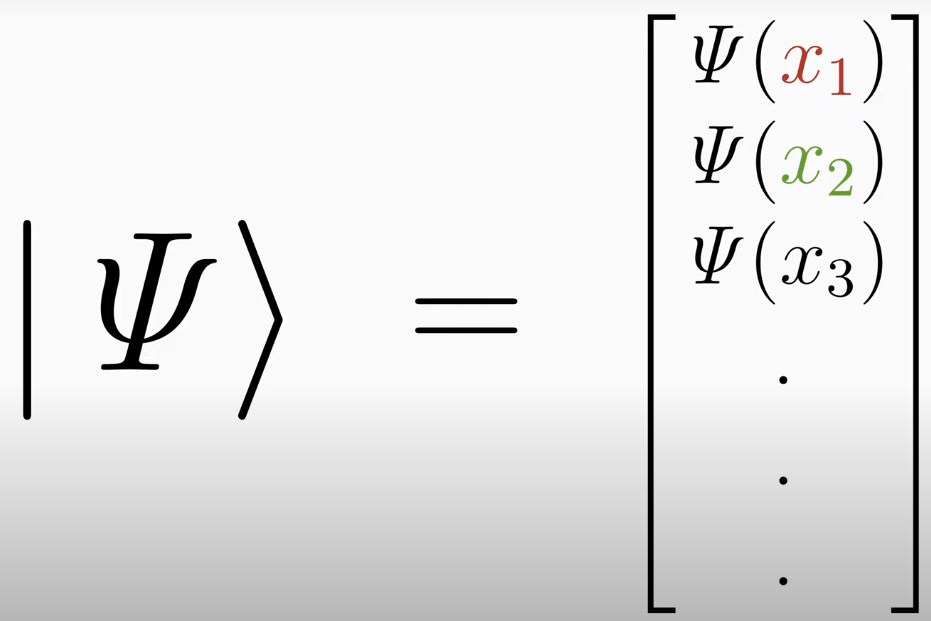
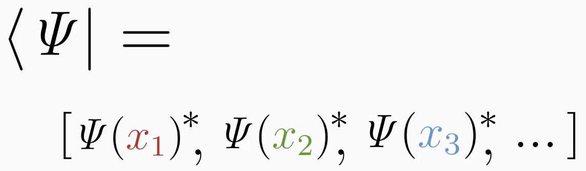
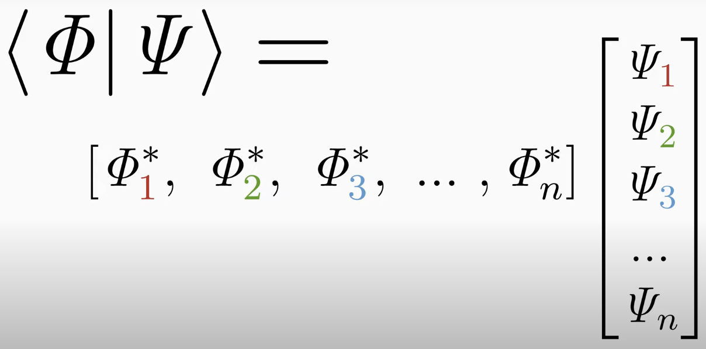
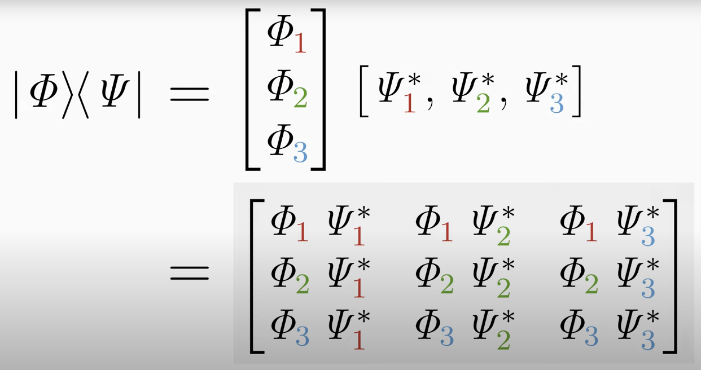
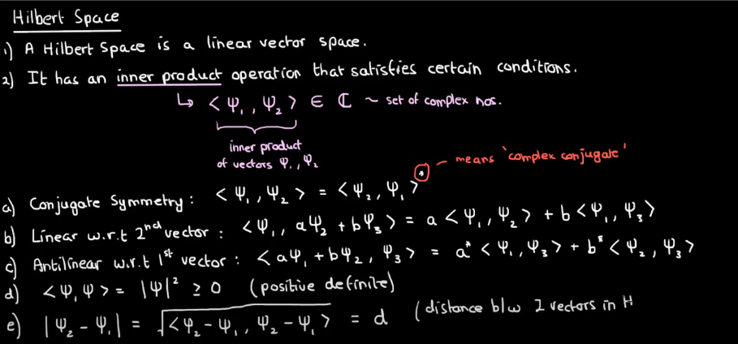

## Day 06 - Dirac's Notation and Hilbert Spaces

### Cheatsheet / Topics Covered

- Linear Functions

  

- Writing vectors as dot products

  

  

- Riesz representation theorem makes the following thing easier

  

- Introduction to the Bra - Ket notation

- The ket representation

  

- The bra representation

  

- The bra-ket notation

  

- Tensor / Outer Product

  

- Hilbert Space

  

Best illustation: https://www.youtube.com/watch?v=7zx3MT9FgT0&list=PLdgVBOaXkb9Bv466YnyxslT4gIlSZdtjw&index=2