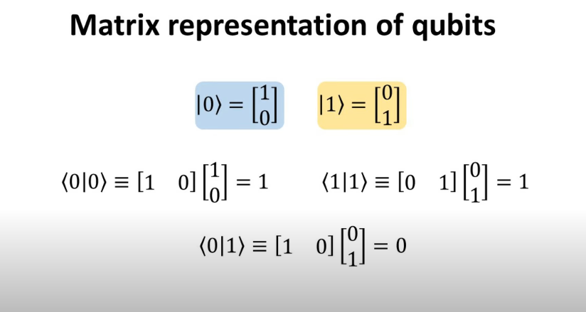

## Day 08 - Qubits and Bloch Sphere Representation

### Cheatsheet / Topics Covered

The Bloch Sphere Representation

  

- Matrix Representation
The Bloch Sphere 

  

  

Single Qubit Transformations:

- Pauli's X,Y,Z gates

  

  

- Hadamard Transformation

  

  

  

- The Rotation Gates

  

